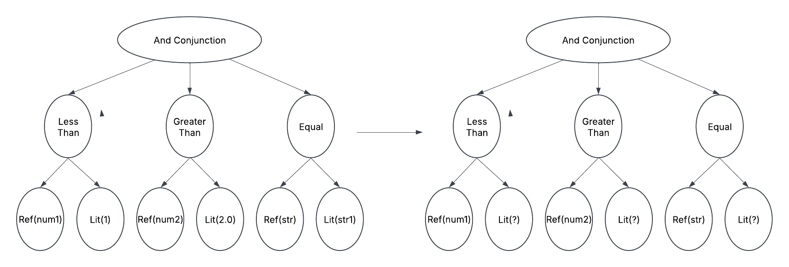

# DazzleDuck SQL Commons

Core DuckDB utilities shared by the server and tooling modules (package
`io.dazzleduck.sql.commons`):

- Connection management (`ConnectionPool`)
- SQL parsing and AST transformation (`Transformations`, `ExpressionFactory`)
- Query fingerprinting (`Fingerprint`)
- Authorization framework and row-level security (`authorization/`)
- Hive / Delta Lake / DuckLake partition pruning and split planning
- Batched Arrow-to-Parquet ingestion with DuckLake catalog registration (`ingestion/`)
- Named-query store and validators (`namedquery/`)

## Requirements

- Java 21 (this module uses records, pattern matching, and virtual threads)
- Maven wrapper (`./mvnw` from the repo root)

```bash
./mvnw compile -pl dazzleduck-sql-commons
./mvnw test -pl dazzleduck-sql-commons
```

## Connection Pooling

`ConnectionPool` is an enum singleton holding one root DuckDB connection; every caller gets a
`connection.duplicate()`. Attachments and extensions loaded on the root connection (via
`executeOnSingleton`, used for startup scripts) are inherited by all duplicates.

- `ConnectionPool.execute(sql)` — execute a statement
- `ConnectionPool.printResult(sql)` — print results to stdout
- `ConnectionPool.getReader(allocator, sql, batchSize)` — stream results as Arrow
- `ConnectionPool.collectAll(connection, sql, recordClass)` — map rows onto a Java record (positional)
- `ConnectionPool.bulkIngestToFile(...)` — `COPY ... TO` with partitioning
- Optional connection properties can be supplied via a `duckdb.properties` classpath resource

## Transformations

`Transformations` round-trips SQL through DuckDB's `json_serialize_sql` /
`json_deserialize_sql`, exposing the query as a JSON AST:

- `Transformations.parseToTree(sql)` — SQL to AST
- `Transformations.parseToSql(tree)` — AST back to SQL
- Generic `transform` / `collect` / `find` walkers with matcher predicates
- `injectFilterCtes(query, filters)` — the row-level-security mechanism: wraps every base-table
  reference in a filtered CTE (used by `RESTRICT_READ_ONLY` mode)
- `pruneUnusedLeftJoins(...)` — removes unused LEFT JOINs when inlining a view
  (see `LEFT_JOIN_PRUNING_SPEC.md` at the repo root)
- `addLimit(query, limit, offset)`, min/max predicate rewriting, partition-predicate stripping
- Two table collectors with distinct security contracts: `getAllTablesOrPathsFromSelect`
  (FROM clause only — for pruning and split planning) and `collectAllTableReferences`
  (whole AST including JOINs, CTE bodies, and expression subqueries — for authorization)



## Fingerprinting

Replaces every literal in the query with a placeholder and hashes the normalized AST with
SHA-256, so queries differing only in constants share a fingerprint.
Read more at https://medium.com/@tanejagagan/ac5e00cb96b5

```bash
./mvnw exec:java -pl dazzleduck-sql-commons -Dexec.mainClass="io.dazzleduck.sql.commons.Fingerprint"
```

Known limitation: does not work with CTEs.


## Authorization

`authorization/SqlAuthorizer` with one implementation per server access mode:

| Instance | Access mode | Behavior |
|----------|-------------|----------|
| `NOOP_AUTHORIZER` | `COMPLETE` | Passes queries through; write access always granted |
| `SELECT_ONLY_AUTHORIZER` | `READ_ONLY` | Rejects anything that is not a SELECT / set operation |
| `RESTRICTED_DATASOURCE_AUTHORIZER` | `RESTRICTED` | Scopes SELECT to one table/path/function from the `x-dd-access` JWT claim (exactly one entry) or legacy claims; injects the row filter into the WHERE clause |
| `RESTRICT_READ_ONLY_AUTHORIZER` | `RESTRICT_READ_ONLY` | SELECT on any table; injects per-table filters as CTEs; rejects table functions and multi-statement queries; unlisted tables get a `false` filter |

`RedirectAuthorizer` resolves grants from an external endpoint when the JWT carries
`x-dd-token-type: redirect` and `x-dd-redirect_url`, with a five-minute response cache.

## Partition Pruning and Split Planning

| Class | Source | Mechanism |
|-------|--------|-----------|
| `hive/HivePartitionPruning` | Hive-style directory layouts | Lists files with `read_blob`, unescapes partition path segments, filters by the query predicate |
| `delta/PartitionPruning` | Delta Lake tables | Delta Kernel scan with the WHERE clause translated to a Delta predicate |
| `ducklake/DucklakePartitionPruning` | DuckLake catalogs | Queries DuckLake metadata tables and prunes on per-file column min/max statistics |
| `planner/PartitionPrunerV2` | dispatch | Routes `read_parquet` / `read_hive` / `read_delta` / DuckLake catalogs to the right pruner |
| `planner/SplitPlanner` | all | Groups pruned files into size-bounded splits and rewrites the FROM clause per split (`read_parquet(list_value(...))`) |

Demo mains:

```bash
./mvnw exec:java -pl dazzleduck-sql-commons -Dexec.mainClass="io.dazzleduck.sql.commons.delta.PartitionPruning"
./mvnw exec:java -pl dazzleduck-sql-commons -Dexec.mainClass="io.dazzleduck.sql.commons.hive.HivePartitionPruning"
```

## Ingestion

The `ingestion/` package implements the server's write path:

- `BulkIngestQueue` — abstract time+size-batched queue: buckets batches until `min_bucket_size`
  or `max_delay_ms`, combines adjacent buckets, enforces `max_pending_write` backpressure
  (clients get a computed retry-after), deduplicates by producer-id/batch-id, rolls back
  producer sequences on failed writes, and drains cleanly on shutdown
- `ParquetIngestionQueue` — writes buckets with `COPY (...) TO` (Parquet, optional
  `PARTITION_BY`), applies per-queue SQL transformations via the `__this` placeholder
- View-based transformations — a mapping may declare `view` + `input_table` (fully qualified,
  mutually exclusive with `transformation`): `DuckLakeIngestionHandler` reads the view's
  definition from `duckdb_views()` and rewrites the input-table reference to `__this`
  (`Transformations.rewriteTableAsThis`), so the transformation is maintained as SQL DDL and
  picked up on schema-version refresh without a restart
- `WatermarkSpec` — per-group MIN timestamp, MAX timestamp, and row count computed per batch and
  inserted into a watermark table in the same transaction as the DuckLake file registration
- `DuckLakeIngestionTaskFactoryProvider` — static queue-to-table mapping from config
  (`ingestion_queue_table_mapping`)
- `DynamicDuckLakeIngestionTaskFactoryProvider` — SQLite-backed queue registry polled at
  runtime (`db_path`, `config_load_interval_ms`); with `manage_tables = true`,
  `DuckLakeTableManager` reconciles target tables non-destructively (CREATE / ADD COLUMN / DROP COLUMN)
- `DuckLakePostIngestionTask` — registers written files with `ducklake_add_data_files` and
  inserts the watermark rows in one transaction

## Other Utilities

- `TableConfigProvider` — overlays configuration values read from a key/value table
  (config block `config_provider`)
- `config/ConfigBasedProvider` — reflective provider loader (`class` key)
- `namedquery/` — `NamedQueryStore`, request/response models, and the reflective validator cache
- `util/HeaderUtils` — CSV header parsing, identifier quoting, and expression validation for
  ingestion headers
- `util/CommandLineConfigUtil` — `--conf key=value` command-line parsing into HOCON
- `auth/Validator` — SHA-256 password hashing and constant-time comparison

## Publishing

Handled by the repo-level release workflow (tag `v*`), or manually:

```bash
export GPG_TTY=$(tty)
./mvnw clean -P release-sign-artifacts -DskipTests deploy
```
